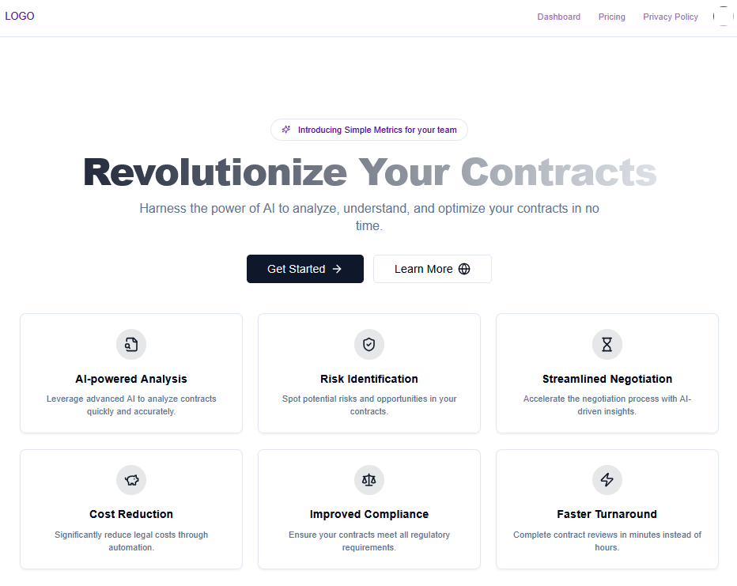
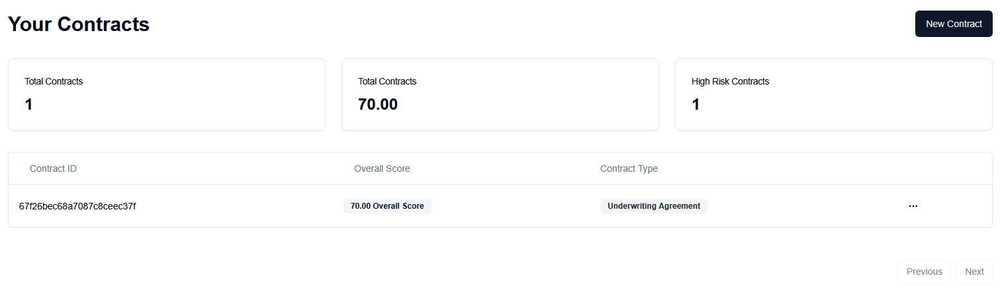
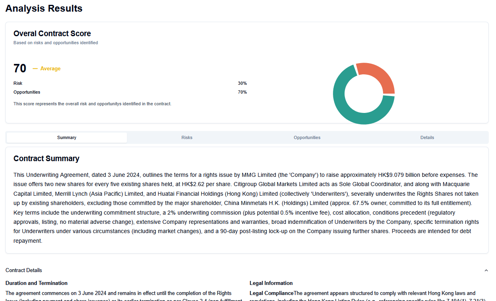
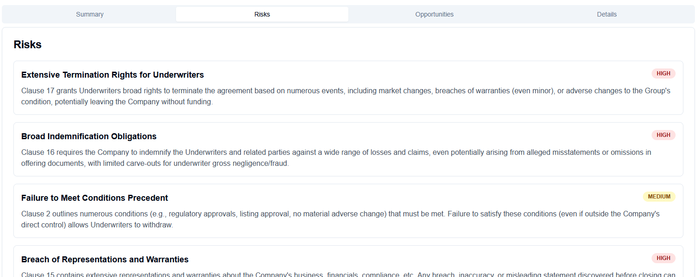

# Contract Analizer
Upload a contract PDF and receive a score and in depth analysis.

## RUN APPLICATION LOCALLY

1) Start Mongo: open terminal in /server and run: docker compose up -d

2) (Optional, for payments)
Make sure Stripe CLI is installed. For Windows, open terminal in /stripe_1.26.1_windows_x86_64
./stripe login      --> Will ask to login on the browser with a confirmation code sent by mail
./stripe listen --forward-to localhost:8080/payments/webhook   --> Copy secret to Server's .env

3) Open terminal in /server and run: npm run dev

4) Open terminal in /client and run: npm run dev

## SETUP 3rd PARTY SERVICES

### MONGO
Instead of using a 3rd party service, we'll 
Go to the folder docker-compose.yaml. Make sure Docker is running.
docker compose up -d

### GOOGLE AUTH
Create project 'Swisshacks2025' and select it
Go to APIs and services, Credentials
Click Create Credentials > Oauth Client ID > Configure consent screen

Google auth platform not configured yet > Click 'Get Started' > Finish configuration

Click Create Credentials > Oauth Client ID
  - Application type: Web application
  - Authorised JavaScript origins: http://localhost:3000
                                   Also url of deployed website if any (e.g. on Vercel or Netlify)

  - Authorized redirect URIs: http://localhost:8080/auth/google/callback

Copy client id and client secret to .env

Push app to production (???)

### REDIS
Create account in Upstash
In Redis tab, create database:
  - Name: contract-redis
  - Region: Frankfurt, Germany (eu-central-1)
  - Free

Go to Javascript tab, copy url (endpoint) and token (password) to .env.
Add 'https://' to the url in .env

### STRIPE
Go to Stripe, click Gear icon > Developers > API Keys
Copy the secret key to Server's .env
Copy the publishable key to Client's .env

Webhook
Go to Stripe > Workbench > Webhooks > Create an local listener
Download/install the Stripe CLI. On Windows, cd into the folder where Stripe.exe is located and run:

    ./stripe login  --> Will ask to login on the browser with a confirmation code sent by mail
    ./stripe listen --forward-to localhost:8080/payments/webhook
Copy the webhook secret to Server's .env

### RESEND
Resend is an email sender service.
Register and add an API key, copy it to Server's .env

### GOOGLE GEMINI
[See Video 1, 2:21:20]

Go to Google AIStudio, create API key (make sure to select the Project created before for Google Auth).

Copy it to Server's .env